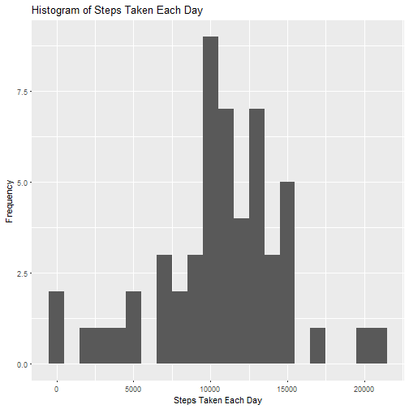
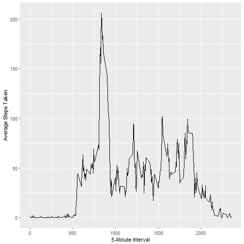
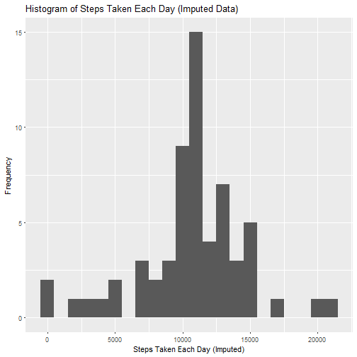
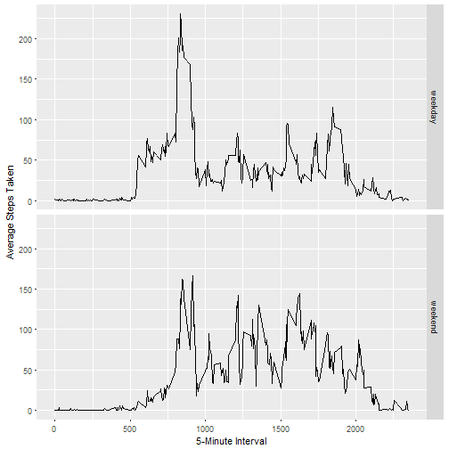

# Reproducible Research: Peer Assessment 1
### Clara Abdurazak | January 25, 2017


---


## Loading and preprocessing the data

**Show any code that is needed to**

***1. Load the data (i.e. read.csv())***


```r
## Read "activity.csv" file
data <- read.csv("activity.csv", header = TRUE)

## Preview data
head(data)
```

```
##   steps       date interval
## 1    NA 2012-10-01        0
## 2    NA 2012-10-01        5
## 3    NA 2012-10-01       10
## 4    NA 2012-10-01       15
## 5    NA 2012-10-01       20
## 6    NA 2012-10-01       25
```


***2. Process/transform the data (if necessary) into a format suitable for your analysis***


```r
## Load {dplyr} package; convert data to {dplyr} table
library(dplyr)
```

```
## 
## Attaching package: 'dplyr'
```

```
## The following objects are masked from 'package:stats':
## 
##     filter, lag
```

```
## The following objects are masked from 'package:base':
## 
##     intersect, setdiff, setequal, union
```

```r
data <- tbl_df(data)
```


---


## What is mean total number of steps taken per day?

**For this part of the assignment, you can ignore the missing values in the dataset.**

***1. Calculate the total number of steps taken per day***


```r
## Group data by date
stepsbydate <- group_by(data, date)

## Create data frame of date and total steps by date
df_stepsbydate <- summarize(stepsbydate, steps = sum(steps))

## Print calculation of total number of steps taken per day
library(xtable)
xt1 <- xtable(df_stepsbydate)
print(xt1, type = "html", row.names = FALSE)
```

<!-- html table generated in R 3.3.2 by xtable 1.8-2 package -->
<!-- Fri Jan 27 15:23:06 2017 -->
<table border=1>
<tr> <th>  </th> <th> date </th> <th> steps </th>  </tr>
  <tr> <td align="right"> 1 </td> <td> 2012-10-01 </td> <td align="right">  </td> </tr>
  <tr> <td align="right"> 2 </td> <td> 2012-10-02 </td> <td align="right"> 126 </td> </tr>
  <tr> <td align="right"> 3 </td> <td> 2012-10-03 </td> <td align="right"> 11352 </td> </tr>
  <tr> <td align="right"> 4 </td> <td> 2012-10-04 </td> <td align="right"> 12116 </td> </tr>
  <tr> <td align="right"> 5 </td> <td> 2012-10-05 </td> <td align="right"> 13294 </td> </tr>
  <tr> <td align="right"> 6 </td> <td> 2012-10-06 </td> <td align="right"> 15420 </td> </tr>
  <tr> <td align="right"> 7 </td> <td> 2012-10-07 </td> <td align="right"> 11015 </td> </tr>
  <tr> <td align="right"> 8 </td> <td> 2012-10-08 </td> <td align="right">  </td> </tr>
  <tr> <td align="right"> 9 </td> <td> 2012-10-09 </td> <td align="right"> 12811 </td> </tr>
  <tr> <td align="right"> 10 </td> <td> 2012-10-10 </td> <td align="right"> 9900 </td> </tr>
  <tr> <td align="right"> 11 </td> <td> 2012-10-11 </td> <td align="right"> 10304 </td> </tr>
  <tr> <td align="right"> 12 </td> <td> 2012-10-12 </td> <td align="right"> 17382 </td> </tr>
  <tr> <td align="right"> 13 </td> <td> 2012-10-13 </td> <td align="right"> 12426 </td> </tr>
  <tr> <td align="right"> 14 </td> <td> 2012-10-14 </td> <td align="right"> 15098 </td> </tr>
  <tr> <td align="right"> 15 </td> <td> 2012-10-15 </td> <td align="right"> 10139 </td> </tr>
  <tr> <td align="right"> 16 </td> <td> 2012-10-16 </td> <td align="right"> 15084 </td> </tr>
  <tr> <td align="right"> 17 </td> <td> 2012-10-17 </td> <td align="right"> 13452 </td> </tr>
  <tr> <td align="right"> 18 </td> <td> 2012-10-18 </td> <td align="right"> 10056 </td> </tr>
  <tr> <td align="right"> 19 </td> <td> 2012-10-19 </td> <td align="right"> 11829 </td> </tr>
  <tr> <td align="right"> 20 </td> <td> 2012-10-20 </td> <td align="right"> 10395 </td> </tr>
  <tr> <td align="right"> 21 </td> <td> 2012-10-21 </td> <td align="right"> 8821 </td> </tr>
  <tr> <td align="right"> 22 </td> <td> 2012-10-22 </td> <td align="right"> 13460 </td> </tr>
  <tr> <td align="right"> 23 </td> <td> 2012-10-23 </td> <td align="right"> 8918 </td> </tr>
  <tr> <td align="right"> 24 </td> <td> 2012-10-24 </td> <td align="right"> 8355 </td> </tr>
  <tr> <td align="right"> 25 </td> <td> 2012-10-25 </td> <td align="right"> 2492 </td> </tr>
  <tr> <td align="right"> 26 </td> <td> 2012-10-26 </td> <td align="right"> 6778 </td> </tr>
  <tr> <td align="right"> 27 </td> <td> 2012-10-27 </td> <td align="right"> 10119 </td> </tr>
  <tr> <td align="right"> 28 </td> <td> 2012-10-28 </td> <td align="right"> 11458 </td> </tr>
  <tr> <td align="right"> 29 </td> <td> 2012-10-29 </td> <td align="right"> 5018 </td> </tr>
  <tr> <td align="right"> 30 </td> <td> 2012-10-30 </td> <td align="right"> 9819 </td> </tr>
  <tr> <td align="right"> 31 </td> <td> 2012-10-31 </td> <td align="right"> 15414 </td> </tr>
  <tr> <td align="right"> 32 </td> <td> 2012-11-01 </td> <td align="right">  </td> </tr>
  <tr> <td align="right"> 33 </td> <td> 2012-11-02 </td> <td align="right"> 10600 </td> </tr>
  <tr> <td align="right"> 34 </td> <td> 2012-11-03 </td> <td align="right"> 10571 </td> </tr>
  <tr> <td align="right"> 35 </td> <td> 2012-11-04 </td> <td align="right">  </td> </tr>
  <tr> <td align="right"> 36 </td> <td> 2012-11-05 </td> <td align="right"> 10439 </td> </tr>
  <tr> <td align="right"> 37 </td> <td> 2012-11-06 </td> <td align="right"> 8334 </td> </tr>
  <tr> <td align="right"> 38 </td> <td> 2012-11-07 </td> <td align="right"> 12883 </td> </tr>
  <tr> <td align="right"> 39 </td> <td> 2012-11-08 </td> <td align="right"> 3219 </td> </tr>
  <tr> <td align="right"> 40 </td> <td> 2012-11-09 </td> <td align="right">  </td> </tr>
  <tr> <td align="right"> 41 </td> <td> 2012-11-10 </td> <td align="right">  </td> </tr>
  <tr> <td align="right"> 42 </td> <td> 2012-11-11 </td> <td align="right"> 12608 </td> </tr>
  <tr> <td align="right"> 43 </td> <td> 2012-11-12 </td> <td align="right"> 10765 </td> </tr>
  <tr> <td align="right"> 44 </td> <td> 2012-11-13 </td> <td align="right"> 7336 </td> </tr>
  <tr> <td align="right"> 45 </td> <td> 2012-11-14 </td> <td align="right">  </td> </tr>
  <tr> <td align="right"> 46 </td> <td> 2012-11-15 </td> <td align="right">  41 </td> </tr>
  <tr> <td align="right"> 47 </td> <td> 2012-11-16 </td> <td align="right"> 5441 </td> </tr>
  <tr> <td align="right"> 48 </td> <td> 2012-11-17 </td> <td align="right"> 14339 </td> </tr>
  <tr> <td align="right"> 49 </td> <td> 2012-11-18 </td> <td align="right"> 15110 </td> </tr>
  <tr> <td align="right"> 50 </td> <td> 2012-11-19 </td> <td align="right"> 8841 </td> </tr>
  <tr> <td align="right"> 51 </td> <td> 2012-11-20 </td> <td align="right"> 4472 </td> </tr>
  <tr> <td align="right"> 52 </td> <td> 2012-11-21 </td> <td align="right"> 12787 </td> </tr>
  <tr> <td align="right"> 53 </td> <td> 2012-11-22 </td> <td align="right"> 20427 </td> </tr>
  <tr> <td align="right"> 54 </td> <td> 2012-11-23 </td> <td align="right"> 21194 </td> </tr>
  <tr> <td align="right"> 55 </td> <td> 2012-11-24 </td> <td align="right"> 14478 </td> </tr>
  <tr> <td align="right"> 56 </td> <td> 2012-11-25 </td> <td align="right"> 11834 </td> </tr>
  <tr> <td align="right"> 57 </td> <td> 2012-11-26 </td> <td align="right"> 11162 </td> </tr>
  <tr> <td align="right"> 58 </td> <td> 2012-11-27 </td> <td align="right"> 13646 </td> </tr>
  <tr> <td align="right"> 59 </td> <td> 2012-11-28 </td> <td align="right"> 10183 </td> </tr>
  <tr> <td align="right"> 60 </td> <td> 2012-11-29 </td> <td align="right"> 7047 </td> </tr>
  <tr> <td align="right"> 61 </td> <td> 2012-11-30 </td> <td align="right">  </td> </tr>
   </table>


***2. Make a histogram of the total number of steps taken each day***


```r
## Load {ggplot2} package
library(ggplot2)

## Plot histogram of total number of steps taken each day
qplot(steps, data = df_stepsbydate, geom = "histogram",
      binwidth = 1000,
      main = "Histogram of Steps Taken Each Day",
      xlab = "Steps Taken Each Day",
      ylab = "Frequency")
```

```
## Warning: Removed 8 rows containing non-finite values (stat_bin).
```




***3. Calculate and report the mean and median of the total number of steps taken per day***


```r
## Get summary of step data
summary(df_stepsbydate$steps)
```

```
##    Min. 1st Qu.  Median    Mean 3rd Qu.    Max.    NA's 
##      41    8841   10760   10770   13290   21190       8
```

- Mean of total number of steps taken per day: **10,770 steps**
- Median of total number of steps taken per day: **10,760 steps**


---


## What is the average daily activity pattern?

***1. Make a time series plot (i.e. type = "l") of the 5-minute interval (x-axis) and the average number of steps taken, averaged across all days (y-axis)***


```r
## Group data by interval
stepsbyinterval <- group_by(data, interval)

## Create data frame of interval and total steps by interval
df_stepsbyinterval <- summarize(stepsbyinterval, steps = mean(steps, na.rm = TRUE))

## Plot time series plot
ggplot(df_stepsbyinterval, aes(interval, steps)) +
    geom_line() +
    xlab("5-Minute Interval") +
    ylab("Average Steps Taken")
```




***2. Which 5-minute interval, on average across all the days in the dataset, contains the maximum number of steps?***


```r
## Arrange data in desc order by steps
ordered <- arrange(df_stepsbyinterval, desc(steps))

## Print interval that contains maximum number of steps
print(ordered$interval[1])
```

```
## [1] 835
```

- Interval that contains maximum number of steps: **835**


---


## Imputing missing values

**Note that there are a number of days/intervals where there are missing values (coded as NA). The presence of missing days may introduce bias into some calculations or summaries of the data.**

***1. Calculate and report the total number of missing values in the dataset (i.e. the total number of rows with NAs)***


```r
## Calculate number of missing values in dataset
sum(is.na(data))
```

```
## [1] 2304
```

- Number of missing values in data set: **2,304**


***2. Devise a strategy for filling in all of the missing values in the dataset. The strategy does not need to be sophisticated. For example, you could use the mean/median for that day, or the mean for that 5-minute interval, etc.***

- Strategy: Replace missing vaules in dataset with the mean for that 5-minute interval.


***3. Create a new dataset that is equal to the original dataset but with the missing data filled in.***


```r
## Copy original dataset
imputed_data <- data

## Create counter for num rows of imputed_data
counter <- 1:nrow(imputed_data)

## Fill in missing data with mean (steps) of that 5-minute interval
for (i in counter) {

    ## Determine if missing value
    if (is.na(imputed_data[i, 1])) {
        
        ## Get 5-minute interval for missing value
        x <- as.numeric(imputed_data[i, 3])
        
        ## Get mean (steps) of that 5-minute interval
        filter <- filter(df_stepsbyinterval, interval == x)
        rep_steps <- filter[1,2]
                
        ## Update imputed dataset by replacing missing value with mean (steps) of that 5-minute interval
        imputed_data[i, 1] <- rep_steps
        
    }

}

## Preview original data set
head(data)
```

```
## # A tibble: 6 × 3
##   steps       date interval
##   <int>     <fctr>    <int>
## 1    NA 2012-10-01        0
## 2    NA 2012-10-01        5
## 3    NA 2012-10-01       10
## 4    NA 2012-10-01       15
## 5    NA 2012-10-01       20
## 6    NA 2012-10-01       25
```

```r
## Preview imputed data set
head(imputed_data)
```

```
## # A tibble: 6 × 3
##       steps       date interval
##       <dbl>     <fctr>    <int>
## 1 1.7169811 2012-10-01        0
## 2 0.3396226 2012-10-01        5
## 3 0.1320755 2012-10-01       10
## 4 0.1509434 2012-10-01       15
## 5 0.0754717 2012-10-01       20
## 6 2.0943396 2012-10-01       25
```


***4. Make a histogram of the total number of steps taken each day and Calculate and report the mean and median total number of steps taken per day. Do these values differ from the estimates from the first part of the assignment? What is the impact of imputing missing data on the estimates of the total daily number of steps?***


```r
## Group imputed data by date
imputed_stepsbydate <- group_by(imputed_data, date)

## Create data frame of date and total imputed steps by interval
df_imputed_stepsbydate <- summarize(imputed_stepsbydate, steps = sum(steps))

# ## Plot histogram of total number of steps taken each day (using imputed dataset)
qplot(steps, data = df_imputed_stepsbydate, geom = "histogram",
      binwidth = 1000,
      main = "Histogram of Steps Taken Each Day (Imputed Data)",
      xlab = "Steps Taken Each Day (Imputed)",
      ylab = "Frequency")
```



- Summary of ORIGINAL dataset:

```r
## Get summary of step data
summary(df_stepsbydate$steps)
```

```
##    Min. 1st Qu.  Median    Mean 3rd Qu.    Max.    NA's 
##      41    8841   10760   10770   13290   21190       8
```

- Summary of IMPUTED dataset:

```r
## Get summary of step data
summary(df_imputed_stepsbydate$steps)
```

```
##    Min. 1st Qu.  Median    Mean 3rd Qu.    Max. 
##      41    9819   10770   10770   12810   21190
```

- Mean of imputed dataset (10,770 steps) remained the same as original dataset (10,770 steps)
- Median of imputed dataset (10,770 steps) increased by 10 compared to original dataset median (10,760 steps)
- Imputing missing data has no impact on the mean, but increases slightly the median of estimate of total daily number of steps

---

## Are there differences in activity patterns between weekdays and weekends?

***1. Create a new factor variable in the dataset with two levels - "weekday" and "weekend" indicating whether a given date is a weekday or weekend day.***


```r
## Convert "date" column to Date class
imputed_data$date <- strptime(imputed_data$date, format = "%Y-%m-%d")

## Create new variable (day.of.week) in dataset with name of week day
imputed_data <- mutate(imputed_data, day.of.week = weekdays(date))

## Create counter for num rows of imputed_data
counter <- 1:nrow(imputed_data)
# counter <- 1:10

## Create vector for day type (weekend/not)
day.type <- c()

## Create array of "weekday" and "weekend" values
for (i in counter) {

    ## Determine if day is weekend, update day.type accordingly
    if ((imputed_data[i, 4] == "Saturday") || (imputed_data[i, 4] == "Sunday")) {
        day.type[i] <- "weekend"
    } else {
        day.type[i] <- "weekday"
    }

}

## Create new factor variable in dataset (day.type) with levels "weekend" and "weekday"
imputed_data <- mutate(imputed_data, day.type = as.factor(day.type))

## Preview updated (imputed) data set
head(imputed_data)
```

```
## # A tibble: 6 × 5
##       steps      date interval day.of.week day.type
##       <dbl>    <dttm>    <int>       <chr>   <fctr>
## 1 1.7169811 <POSIXlt>        0      Monday  weekday
## 2 0.3396226 <POSIXlt>        5      Monday  weekday
## 3 0.1320755 <POSIXlt>       10      Monday  weekday
## 4 0.1509434 <POSIXlt>       15      Monday  weekday
## 5 0.0754717 <POSIXlt>       20      Monday  weekday
## 6 2.0943396 <POSIXlt>       25      Monday  weekday
```


***2. Make a panel plot containing a time series plot (i.e. type = "l") of the 5-minute interval (x-axis) and the average number of steps taken, averaged across all weekday days or weekend days (y-axis).***


```r
## Create data frame with average steps taken, averaged accross all weekday or weekend days
panel_data <- imputed_data %>% 
    mutate(date = as.character(date)) %>%
    group_by(interval, day.type) %>%
    summarize(avg.steps = mean(steps))

# ## Create panel plot
ggplot(panel_data, aes(x=interval, y=avg.steps)) +
    geom_line() +
    facet_grid(day.type ~ .) +
    xlab("5-Minute Interval") +
    ylab("Average Steps Taken")
```




